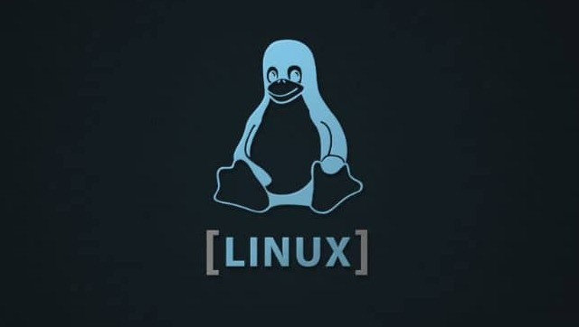

# Linux-101

This Linux 101 course covers the fundamentals of Operating Systems, Linux Fundamentals, Linux terminal, and Bash scripting.

Students will learn about the Linux operating system and its various components, including its powerful terminal. They will also become familiar with basic Linux commands and file system navigation.

The course will cover Bash scripting, a powerful tool for automating tasks and customizing the computing environment. Students will learn how to write basic Bash scripts using commands such as echo, if, and for.

This course is ideal for beginners who want to learn the basics of Linux and command-line interfaces. It is also suitable for anyone interested in system administration, data processing, or automation.

By the end of the course, students will have a solid foundation in Linux and be able to use the command line efficiently and effectively. They will also be able to write simple Bash scripts to automate tasks.

Note: This Linux 101 course is specifically designed to be taught on the Ubuntu platform, one of the most popular and widely used Linux distributions. While many of the concepts covered in this course are applicable to other Linux distributions, the commands and tools used throughout the course are specific to Ubuntu.
